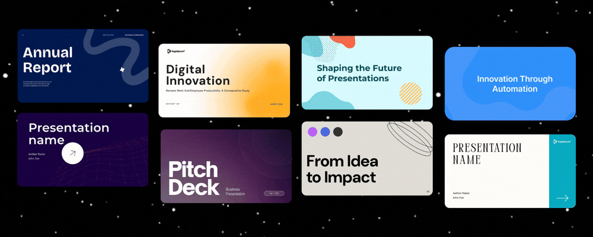
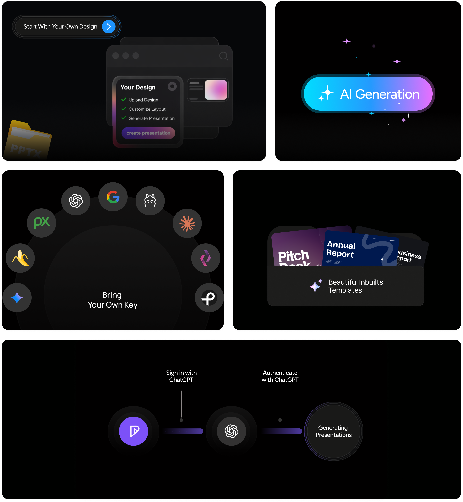
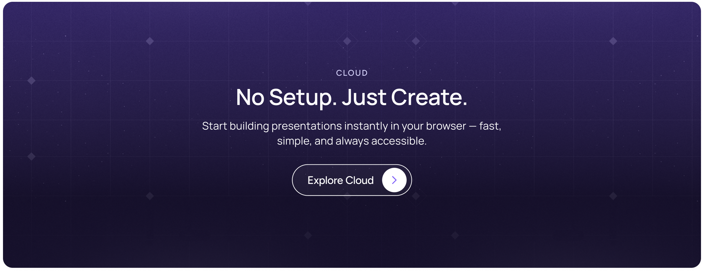

<p align="center">
  
</p>

<p align="center">
  <a href="https://presenton.ai/download"><strong>Quickstart</strong></a> &middot;
  <a href="https://docs.presenton.ai/"><strong>Docs</strong></a> &middot;
  <a href="https://www.youtube.com/@presentonai"><strong>Youtube</strong></a> &middot;
  <a href="https://discord.gg/9ZsKKxudNE"><strong>Discord</strong></a>
</p>

<p align="center">
  <a href="https://github.com/presenton/presenton/blob/main/LICENSE"></a>
  <a href="https://github.com/presenton/presenton"></a>
  <a href="https://presenton.ai/"></a>
</p>

# Open-Source AI Presentation Generator and API (Gamma, Beautiful AI, Decktopus Alternative)

### ✨ Why Presenton

No SaaS lock-in · No forced subscriptions · Full control over models and data

What makes Presenton different?

- Fully **self-hosted**; Web (Docker) & Desktop (Mac, Windows & Linux)
- Works with OpenAI, Gemini, Anthropic, Ollama, or custom models
- API deployable
- Fully open-source (Apache 2.0)
- Use your **existing PPTX files as templates** for AI presentation generation

> [!TIP]
> **Star us!** A ⭐ shows your support and encourages us to keep building! 😇

<p align="center">
  
</p>

#

### 🎛 Features

<p align="center">
  
</p>

#

### 💻 Presenton Desktop

Create AI-powered presentations using your own model provider (BYOK) or run everything locally on your own machine for full control and data privacy.

<p align="center">
  <a href="https://presenton.ai/download">
    
  </a>
</p>

**Available Platforms**

<table>
<tr>
<th align="left">Platform</th>
<th align="left">Architecture</th>
<th align="left">Package</th>
<th align="left">Download</th>
</tr>

<tr>
<td><b>macOS</b></td>
<td>Apple Silicon / Intel</td>
<td><code>.dmg</code></td>
<td><a href="https://presenton.ai/download">Download ↗</a></td>
</tr>

<tr>
<td><b>Windows</b></td>
<td>x64</td>
<td><code>.exe</code></td>
<td><a href="https://presenton.ai/download">Download ↗</a></td>
</tr>

<tr>
<td><b>Linux</b></td>
<td>x64</td>
<td> <code>.deb</code></td>
<td><a href="https://presenton.ai/download">Download ↗</a></td>
</tr>

</table>

Presenton gives you complete control over your AI presentation workflow. Choose your models, customize your experience, and keep your data private.

- Custom Templates & Themes — Create unlimited presentation designs with HTML and Tailwind CSS
- AI Template Generation — Create presentation templates from existing Powerpoint documents.
- Flexible Generation — Build presentations from prompts or uploaded documents
- Export Ready — Save as PowerPoint (PPTX) and PDF with professional formatting
- Built-In MCP Server — Generate presentations over Model Context Protocol
- Bring Your Own Key — Use your own API keys for OpenAI, Google Gemini, Anthropic Claude, or any compatible provider. Only pay for what you use, no hidden fees or subscriptions.
- Ollama Integration — Run open-source models locally with full privacy
- OpenAI API Compatible — Connect to any OpenAI-compatible endpoint with your own models
- Multi-Provider Support — Mix and match text and image generation providers
- Versatile Image Generation — Choose from DALL-E 3, Gemini Flash, Pexels, or Pixabay
- Rich Media Support — Icons, charts, and custom graphics for professional presentations
- Runs Locally — All processing happens on your device, no cloud dependencies
- API Deployment — Host as your own API service for your team
- Fully Open-Source — Apache 2.0 licensed, inspect, modify, and contribute
- Docker Ready — One-command deployment with GPU support for local models
- Electron Desktop App — Run Presenton as a native desktop application on Windows, macOS, and Linux (no browser required)
- Sign in with ChatGPT — Use your free or paid ChatGPT account to sign in and start creating presentations instantly — no separate API key required

#

### ☁️ Presenton Cloud

Run Presenton directly in your browser — no installation, no setup required. Start creating presentations instantly from anywhere.

<p align="center">
  <a href="https://presenton.ai">
    
  </a>
</p>

#

### ⚡ Running Presenton

  <p>
    You can run Presenton in two ways:
    <strong>Docker</strong> for a one-command setup without installing a local dev
    stack, or the <strong>Electron desktop app</strong> for a native app
    experience (ideal for development or offline use).
  </p>

**Option 1: Electron (Desktop App)**

   <p>
    Run Presenton as a native desktop application. LLM and image provider
    (API keys, etc.) can be configured in the app. The same environment variables
    used for Docker apply when running the bundled backend.
  </p>

  <p>
    <strong>Prerequisites:</strong> Node.js (LTS), npm, Python 3.11, and
    <a href="https://docs.astral.sh/uv/">uv</a>
    (for the Electron FastAPI backend in
    <code>electron/servers/fastapi</code>).
  </p>

- Setup (First Time)
  <pre><code class="language-bash">cd electron
  npm run setup:env</code></pre>

  This installs Node dependencies, runs <code>uv sync</code> in the FastAPI
  server, and installs Next.js dependencies.

- Run in Development
  <pre><code class="language-bash">npm run dev</code></pre>
  <p>
  This compiles TypeScript and starts Electron. The backend and UI run locally
  inside the desktop window.
  </p>

- Build Distributable (Optional)
  To create installers for Windows, macOS, or Linux:
  <pre><code class="language-bash">npm run build:all
  npm run dist</code></pre>
  <p>
  Output files are written to <code>electron/dist</code>
  (or as configured in your <code>electron-builder</code> settings).
  </p>

**Option 2: Docker**

- Start Presenton
  Linux/MacOS (Bash/Zsh Shell):
  <pre><code class="language-bash">docker run -it --name presenton -p 5000:80 -v "./app_data:/app_data" ghcr.io/presenton/presenton:latest</code></pre>

  Windows (PowerShell):
  <pre><code class="language-bash">docker run -it --name presenton -p 5000:80 -v "${PWD}\app_data:/app_data" ghcr.io/presenton/presenton:latest</code></pre>

- Open Presenton
  <p>
  Open <a href="http://localhost:5000">http://localhost:5000</a> in the browser
  of your choice to use Presenton.
  </p>

  <blockquote>
  <p>
    <strong>Note:</strong> You can replace <code>5000</code> with any other port
    number of your choice to run Presenton on a different port number.
  </p>
  </blockquote>

#

### ⚙️ Deployment Configurations

The lists below match the environment variables forwarded in this repository’s **`docker-compose.yml`** (`production`, `production-gpu`, `development`, and `development-gpu`). Put values in a `.env` file next to the compose file, or export them before `docker compose up`. The Electron app backend can read the same names when run outside Docker.

Other optional variables exist in code (for example advanced Mem0 paths, LiteParse runners, or `FAST_API_INTERNAL_URL` when Next.js and FastAPI are not same-origin); they are **not** wired in `docker-compose.yml`. Supported names are discoverable from `servers/fastapi/utils/get_env.py` and the Next.js server utilities under `servers/nextjs/`.

#### LLM and API keys

- **CAN_CHANGE_KEYS**=[true/false]: Set to **false** if you want to keep API keys hidden and make them unmodifiable.
- **LLM**=[openai/google/anthropic/ollama/custom/codex]: Select the text **LLM**.
- **OPENAI_API_KEY**: Required if **LLM** is **openai**.
- **OPENAI_MODEL**: Required if **LLM** is **openai** (default: `gpt-4.1`).
- **GOOGLE_API_KEY**: Required if **LLM** is **google**.
- **GOOGLE_MODEL**: Required if **LLM** is **google** (default: `models/gemini-2.0-flash`).
- **ANTHROPIC_API_KEY**: Required if **LLM** is **anthropic**.
- **ANTHROPIC_MODEL**: Required if **LLM** is **anthropic** (default: `claude-3-5-sonnet-20241022`).
- **CODEX_MODEL**: Required if **LLM** is **codex** (Codex OAuth flow; compose maps host port **1455** for the callback).
- **CUSTOM_LLM_URL**: OpenAI-compatible base URL if **LLM** is **custom**.
- **CUSTOM_LLM_API_KEY**: API key if **LLM** is **custom**.
- **CUSTOM_MODEL**: Model id if **LLM** is **custom**.
- **DISABLE_THINKING**=[true/false]: If **true**, disables “thinking” on the custom LLM.
- **WEB_GROUNDING**=[true/false]: If **true**, enables web search for OpenAI, Google, and Anthropic models.
- **EXTENDED_REASONING**=[true/false]: Enables extended reasoning where supported by the configured stack.

#### Ollama

Use when **LLM** is **ollama**:

- **OLLAMA_URL**: Base URL of the Ollama HTTP API (e.g. `http://host.docker.internal:11434` from Docker).
- **OLLAMA_MODEL**: Model name in Ollama (e.g. `llama3.2:3b`).
- **START_OLLAMA**=[true/false]: Container entrypoint (`start.js`): optional install + `ollama serve`. Default **false** (`development` / `production` compose).

#### Presentation memory (Mem0 OSS)

Mem0 uses local Qdrant + SQLite (OSS); memory is scoped per presentation.

| Variable | Purpose |
|----------|---------|
| **MEM0_ENABLED** | **true**/false (compose default **true**). |
| **MEM0_DIR** | Root directory (compose default **`/app_data/mem0`**). |
| **MEM0_EMBEDDER_PROVIDER** | Embedder backend (compose default **`fastembed`**). |
| **MEM0_EMBEDDER_MODEL** | Model id (compose default **`BAAI/bge-small-en-v1.5`**). |
| **MEM0_EMBEDDING_DIMS** | Vector size (compose default **384**). |

#### Document parsing (LiteParse)

| Variable | Purpose |
|----------|---------|
| **LITEPARSE_DPI** | OCR render DPI (compose default **120**). |
| **LITEPARSE_NUM_WORKERS** | Worker count (compose default **1**). |

#### Database

- **DATABASE_URL**: SQLAlchemy URL; if unset, the app falls back to SQLite under app data.
- **MIGRATE_DATABASE_ON_STARTUP**: Compose sets **`true`** for all services so migrations run on startup.

#### Image generation

These variables match `docker-compose.yml`. **`IMAGE_PROVIDER`** selects the backend (`pexels`, `pixabay`, `gemini_flash`, `nanobanana_pro`, `dall-e-3`, `gpt-image-1.5`, `comfyui`, `open_webui`). Use **OPENAI_API_KEY** for OpenAI image modes and **GOOGLE_API_KEY** for Gemini image modes (same keys as the LLM section).

- **DISABLE_IMAGE_GENERATION**=[true/false]: Disable slide image generation.
- **IMAGE_PROVIDER**: Provider id (see enum above).
- **PEXELS_API_KEY**: Pexels stock images.
- **PIXABAY_API_KEY**: Pixabay stock images.
- **DALL_E_3_QUALITY**=[standard/hd]: Optional for **dall-e-3** (default `standard`).
- **GPT_IMAGE_1_5_QUALITY**=[low/medium/high]: Optional for **gpt-image-1.5** (default `medium`).
- **COMFYUI_URL** / **COMFYUI_WORKFLOW**: Self-hosted ComfyUI workflow JSON.
- **OPEN_WEBUI_IMAGE_URL** / **OPEN_WEBUI_IMAGE_API_KEY**: Open WebUI–compatible image endpoint.

#### Telemetry

- **DISABLE_ANONYMOUS_TRACKING**=[true/false]: Set to **true** to disable anonymous telemetry.

#### Authentication (web login)

Presenton uses a **single admin account** per instance. Credentials live in `app_data` (hashed; see `userConfig.json`). Pass these with `-e` or via `.env` for compose:

- **AUTH_USERNAME** / **AUTH_PASSWORD** — Preseed the admin login on first boot (password at least 6 characters). Ignored if a user already exists unless **AUTH_OVERRIDE_FROM_ENV** is set.
- **AUTH_OVERRIDE_FROM_ENV**=[true/false] — If **true**, replace stored credentials from the env vars on every FastAPI startup and rotate the session signing secret (invalidates existing sessions). Remove after a one-off rotation.
- **RESET_AUTH**=[true/false] — If **true**, clear stored credentials on startup. Use for a **single** boot to recover access, then unset.

**Examples**

```bash
docker run -it --name presenton -p 5000:80 -v "./app_data:/app_data" ghcr.io/presenton/presenton:latest
```

```bash
docker run -it --name presenton -p 5000:80 -e AUTH_USERNAME=admin -e AUTH_PASSWORD=changeme123 -v "./app_data:/app_data" ghcr.io/presenton/presenton:latest
```

```bash
docker run -it --name presenton -p 5000:80 -e AUTH_USERNAME=admin -e AUTH_PASSWORD=changeme123 -v "${PWD}\app_data:/app_data" ghcr.io/presenton/presenton:latest
```

```bash
docker stop presenton && docker rm presenton && docker run -it --name presenton -p 5000:80 -e AUTH_USERNAME=admin -e AUTH_PASSWORD=newcred456 -e AUTH_OVERRIDE_FROM_ENV=true -v "./app_data:/app_data" ghcr.io/presenton/presenton:latest
```

```bash
docker stop presenton && docker rm presenton && docker run -it --name presenton -p 5000:80 -e RESET_AUTH=true -v "./app_data:/app_data" ghcr.io/presenton/presenton:latest
```

```bash
docker stop presenton && docker rm presenton && docker run -it --name presenton -p 5000:80 -e AUTH_USERNAME=admin -e AUTH_PASSWORD=changeme123 -v "./app_data:/app_data" ghcr.io/presenton/presenton:latest
```

**Manual reset:** stop the container, edit `./app_data/userConfig.json`, delete `AUTH_USERNAME`, `AUTH_PASSWORD_HASH`, and `AUTH_SECRET_KEY`, save, and start again.

Sign out from the app: **Settings → Other → Sign out**.

> Note: LLM and image variables above are forwarded from **`docker-compose.yml`** when set in `.env`.

<br>
<br>

**Docker Run Examples by Provider**

Same variables as compose; use `-e` instead of `.env` when running `docker run` directly.

- Using OpenAI
    <pre><code class="language-bash">docker run -it --name presenton -p 5000:80 -e LLM="openai" -e OPENAI_API_KEY="******" -e IMAGE_PROVIDER="dall-e-3" -e CAN_CHANGE_KEYS="false" -v "./app_data:/app_data" ghcr.io/presenton/presenton:latest</code></pre>

- Using Google
    <pre><code class="language-bash">docker run -it --name presenton -p 5000:80 -e LLM="google" -e GOOGLE_API_KEY="******" -e IMAGE_PROVIDER="gemini_flash" -e CAN_CHANGE_KEYS="false" -v "./app_data:/app_data" ghcr.io/presenton/presenton:latest</code></pre>

- Using Ollama
    <pre><code class="language-bash">docker run -it --name presenton -p 5000:80 -e LLM="ollama" -e OLLAMA_MODEL="llama3.2:3b" -e IMAGE_PROVIDER="pexels" -e PEXELS_API_KEY="*******" -e CAN_CHANGE_KEYS="false" -v "./app_data:/app_data" ghcr.io/presenton/presenton:latest</code></pre>

- Using Anthropic
    <pre><code class="language-bash">docker run -it --name presenton -p 5000:80 -e LLM="anthropic" -e ANTHROPIC_API_KEY="******" -e IMAGE_PROVIDER="pexels" -e PEXELS_API_KEY="******" -e CAN_CHANGE_KEYS="false" -v "./app_data:/app_data" ghcr.io/presenton/presenton:latest</code></pre>

- Using OpenAI Compatible API
    <pre><code class="language-bash">docker run -it -p 5000:80 -e CAN_CHANGE_KEYS="false"  -e LLM="custom" -e CUSTOM_LLM_URL="http://*****" -e CUSTOM_LLM_API_KEY="*****" -e CUSTOM_MODEL="llama3.2:3b" -e IMAGE_PROVIDER="pexels" -e  PEXELS_API_KEY="********" -v "./app_data:/app_data" ghcr.io/presenton/presenton:latest</code></pre>

- Running Presenton with GPU Support
  To use GPU acceleration with Ollama models, you need to install and configure the NVIDIA Container Toolkit. This allows Docker containers to access your NVIDIA GPU.
  Once the NVIDIA Container Toolkit is installed and configured, you can run Presenton with GPU support by adding the `--gpus=all` flag:
    <pre><code class="language-bash">docker run -it --name presenton --gpus=all -p 5000:80 -e LLM="ollama" -e OLLAMA_MODEL="llama3.2:3b" -e IMAGE_PROVIDER="pexels" -e PEXELS_API_KEY="*******" -e CAN_CHANGE_KEYS="false" -v "./app_data:/app_data" ghcr.io/presenton/presenton:latest</code></pre>

#

### ✨ Generate Presentation via API

**Generate Presentation**

<p>
<strong>Endpoint:</strong> <code>/api/v1/ppt/presentation/generate</code><br>
<strong>Method:</strong> <code>POST</code><br>
<strong>Content-Type:</strong> <code>application/json</code>
</p>

**Request Body**

<table>
<thead>
<tr>
<th>Parameter</th>
<th>Type</th>
<th>Required</th>
<th>Description</th>
</tr>
</thead>
<tbody>

<tr>
<td><code>content</code></td>
<td>string</td>
<td>Yes</td>
<td>Main content used to generate the presentation.</td>
</tr>

<tr>
<td><code>slides_markdown</code></td>
<td>string[] | null</td>
<td>No</td>
<td>Provide custom slide markdown instead of auto-generation.</td>
</tr>

<tr>
<td><code>instructions</code></td>
<td>string | null</td>
<td>No</td>
<td>Additional generation instructions.</td>
</tr>

<tr>
<td><code>tone</code></td>
<td>string</td>
<td>No</td>
<td>
Text tone (default: <code>"default"</code>).  
Options: <code>default</code>, <code>casual</code>, <code>professional</code>, 
<code>funny</code>, <code>educational</code>, <code>sales_pitch</code>
</td>
</tr>

<tr>
<td><code>verbosity</code></td>
<td>string</td>
<td>No</td>
<td>
Content density (default: <code>"standard"</code>).  
Options: <code>concise</code>, <code>standard</code>, <code>text-heavy</code>
</td>
</tr>

<tr>
<td><code>web_search</code></td>
<td>boolean</td>
<td>No</td>
<td>Enable web search grounding (default: <code>false</code>).</td>
</tr>

<tr>
<td><code>n_slides</code></td>
<td>integer</td>
<td>No</td>
<td>Number of slides to generate (default: <code>8</code>).</td>
</tr>

<tr>
<td><code>language</code></td>
<td>string</td>
<td>No</td>
<td>Presentation language (default: <code>"English"</code>).</td>
</tr>

<tr>
<td><code>template</code></td>
<td>string</td>
<td>No</td>
<td>Template name (default: <code>"general"</code>).</td>
</tr>

<tr>
<td><code>include_table_of_contents</code></td>
<td>boolean</td>
<td>No</td>
<td>Include table of contents slide (default: <code>false</code>).</td>
</tr>

<tr>
<td><code>include_title_slide</code></td>
<td>boolean</td>
<td>No</td>
<td>Include title slide (default: <code>true</code>).</td>
</tr>

<tr>
<td><code>files</code></td>
<td>string[] | null</td>
<td>No</td>
<td>
Files to use in generation.  
Upload first via <code>/api/v1/ppt/files/upload</code>.
</td>
</tr>

<tr>
<td><code>export_as</code></td>
<td>string</td>
<td>No</td>
<td>
Export format (default: <code>"pptx"</code>).  
Options: <code>pptx</code>, <code>pdf</code>
</td>
</tr>

</tbody>
</table>

**Response**

<pre><code class="language-json">{
  "presentation_id": "string",
  "path": "string",
  "edit_path": "string"
}</code></pre>

**Example Request**

<pre><code class="language-bash">curl -X POST http://localhost:5000/api/v1/ppt/presentation/generate \
  -H "Content-Type: application/json" \
  -d '{
    "content": "Introduction to Machine Learning",
    "n_slides": 5,
    "language": "English",
    "template": "general",
    "export_as": "pptx"
  }'</code></pre>

**Example Response**

<pre><code class="language-json">{
  "presentation_id": "d3000f96-096c-4768-b67b-e99aed029b57",
  "path": "/app_data/d3000f96-096c-4768-b67b-e99aed029b57/Introduction_to_Machine_Learning.pptx",
  "edit_path": "/presentation?id=d3000f96-096c-4768-b67b-e99aed029b57"
}</code></pre>

<blockquote>
<strong>Note:</strong>  
Prepend your server’s root URL to <code>path</code> and 
<code>edit_path</code> to construct valid links.
</blockquote>

**Documentation & Tutorials**

<ul>
  <li>
    <a href="https://docs.presenton.ai/using-presenton-api">
      Full API Documentation
    </a>
  </li>
  <li>
    <a href="https://docs.presenton.ai/tutorial/generate-presentation-over-api">
      Generate Presentations via API in 5 Minutes
    </a>
  </li>
  <li>
    <a href="https://docs.presenton.ai/tutorial/generate-presentation-from-csv">
      Create Presentations from CSV using AI
    </a>
  </li>
  <li>
    <a href="https://docs.presenton.ai/tutorial/create-data-reports-using-ai">
      Create Data Reports Using AI
    </a>
  </li>
</ul>

#

### 🚀 Roadmap

Track the public roadmap on GitHub Projects: [https://github.com/orgs/presenton/projects/2](https://github.com/orgs/presenton/projects/2)

#

<p align="left">
  <a href="https://www.youtube.com/@presentonai?sub_confirmation=1">
    
  </a>
</p>
