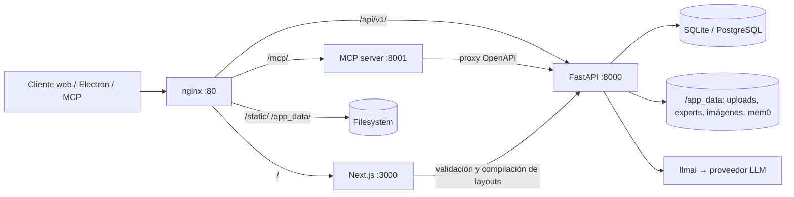
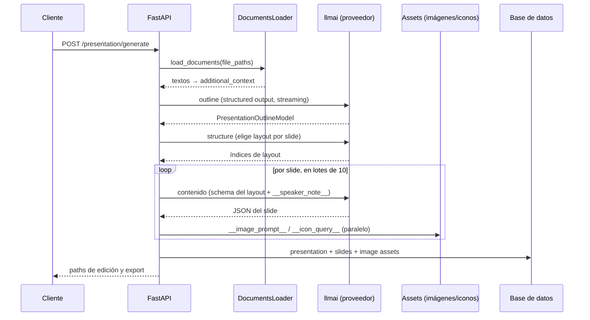

# Arquitectura de Presenton (fork Nodemat)

Mapa del código del upstream `presenton/presenton` al momento del fork (commit `290fedcd`), con foco en los puntos de integración que necesitan las fases 2 a 6 del roadmap. Este documento es el entregable de la Fase 1 (reconocimiento) y la referencia para tocar el core lo mínimo posible: los cambios grandes van en módulos nuevos.

Las referencias `archivo:línea` fueron verificadas contra el código en el commit citado. Si hacés rebase contra upstream, revalidá las líneas de los puntos de enganche (sección 10) antes de confiar en ellas.

## 1. Vista general

Monorepo con dos servidores y un wrapper de escritorio:

- `servers/fastapi/`: backend Python (FastAPI + SQLModel + Alembic). Toda la lógica de ingesta, generación, export y auth.
- `servers/nextjs/`: frontend Next.js 16 (App Router, React 19, Tailwind, Redux Toolkit). También aloja los templates de slides y algunos endpoints propios (validación y compilación de layouts).
- `electron/`: empaquetado desktop; incluye el runner de extracción de documentos (`resources/document-extraction/liteparse_runner.mjs`).
- `.do/`: template de deploy para DigitalOcean App Platform.

En runtime (Docker) conviven cuatro procesos orquestados por `start.js` detrás de nginx (`nginx.conf`):

| Ruta pública | Proceso | Puerto interno |
|---|---|---|
| `/` | Next.js | 3000 |
| `/api/v1/`, `/docs`, `/openapi.json` | FastAPI (uvicorn) | 8000 |
| `/mcp/` | Servidor MCP (`servers/fastapi/mcp_server.py`) | 8001 |
| `/static/`, `/app_data/` | Filesystem (nginx directo, con auth check interno) | — |



Los datos persistentes viven en el volumen `/app_data`: base SQLite (`fastapi.db` por defecto), `userConfig.json` (API keys y credenciales), uploads, exports, imágenes generadas, fuentes y la memoria Mem0.

## 2. Ingesta de documentos

Pipeline de tres etapas, todo en `servers/fastapi`:

1. Upload: `POST /api/v1/ppt/files/upload` (`api/v1/ppt/endpoints/files.py:15-36`). Valida con `utils/validators.py` (100 MB máximo por archivo, MIME más extensión contra `constants/documents.py`) y guarda los binarios en `{TEMP_DIRECTORY}/{uuid}/` vía `services/temp_file_service.py`.
2. Decompose: `POST /api/v1/ppt/files/decompose` (`files.py:39-79`). Convierte cada archivo a texto/markdown y lo guarda como `.txt` temporal. Lo usa el frontend para previsualizar.
3. Generate: tanto `generate_presentation_handler()` (`api/v1/ppt/endpoints/presentation.py:747-755`) como el stream de outlines (`api/v1/ppt/endpoints/outlines.py:113-122`) vuelven a cargar los archivos con `DocumentsLoader` y concatenan los textos en la variable `additional_context`, que entra al prompt del outline.

El orquestador del parsing es `DocumentsLoader` (`services/documents_loader.py:163`). Instancia sus servicios por composición en el constructor (líneas 166-179) y despacha por extensión en `load_documents()` (líneas 219-237):

| Extensión | Servicio | Detalle |
|---|---|---|
| `.pdf` | `LiteParseService` | Subprocess Node.js con `@llamaindex/liteparse`; `pdfplumber` detecta si es escaneado y en ese caso sube el OCR a DPI 300 (`load_pdf`, líneas 246-259) |
| `.txt` | Lectura directa | — |
| Office/ODF (docx, pptx, xlsx, odt, csv, ...) | `OfficeDocumentService` | Extracción directa del XML dentro del ZIP, sin dependencias pesadas |
| Imágenes (jpg, png, tiff, ...) | `DocumentConversionService` + `LiteParseService` | Pillow normaliza a PNG y LiteParse la OCRea |
| Resto | `LiteParseService` | Fallback genérico |

Después de cada parseo se aplica `clean_extracted_document_text()` (líneas 146-160), que desenvuelve los wrappers JSON de LiteParse en hasta cuatro pasadas.

El constructor ya contempla un servicio alternativo opcional: `document_service` se instancia solo si el import condicional de `DocumentServiceCls` resolvió (líneas 177-179; hoy esa clase no existe en el repo y el import falla en silencio). El patrón de servicio intercambiable está previsto por el propio upstream.

El texto extraído no se persiste en la base: se usa en memoria para armar el prompt del outline y se indexa en Mem0 como contexto de generación (`store_generation_context`, `presentation.py:779-794`). En `presentations.file_paths` quedan solo los paths temporales.

## 3. Flujo de generación (documento/prompt → outline → slides)

Endpoints principales en `api/v1/ppt/endpoints/`:

- `POST /presentation/create` (`presentation.py:235-310`): crea el registro `PresentationModel` con la configuración (contenido, n_slides, idioma, tono, verbosity, archivos, instrucciones). No genera nada todavía.
- `GET /outlines/stream/{id}` (`outlines.py:82-260`): genera el outline con streaming SSE.
- `GET /presentation/stream/{id}` (`presentation.py:392-614`): genera los slides con streaming SSE.
- `POST /presentation/generate` y `/generate/async` (`presentation.py:1113-1170`): flujo completo en una sola llamada; ambos delegan en `generate_presentation_handler()` (`presentation.py:723`). La variante async registra el progreso en la tabla `async_presentation_generation_tasks`.



Pasos en detalle:

1. Outline: `generate_ppt_outline()` (`utils/llm_calls/generate_presentation_outlines.py:216-367`). Structured output estricto contra el schema de `PresentationOutlineModel` (lista de slides, cada uno markdown con `## título`). Soporta web search opcional: nativa del modelo (WebSearchTool) o externa (Tavily, SearXNG, Exa, Brave, Serper). La respuesta cruda se parsea con `dirtyjson` (`presentation.py:815-824`).
2. Estructura: `generate_presentation_structure()` (`utils/llm_calls/generate_presentation_structure.py:135-184`). El LLM elige qué layout del template usa cada slide y devuelve una lista de índices (`PresentationStructureModel`). Si el template declara `ordered: true` en su `settings.json`, este paso se saltea. El layout se resuelve con `get_layout_by_name()` (`templates/get_layout_by_name.py`), que consulta los `settings.json` locales o el endpoint `/api/template` de Next.js.
3. Contenido por slide: `get_slide_content_from_type_and_outline()` (`utils/llm_calls/generate_slide_content.py:169-223`). Una llamada LLM por slide, en lotes concurrentes de 10, con structured output contra el JSON Schema del layout elegido. Antes de llamar, al schema se le quitan los campos `__image_url__` e `__icon_url__` (los completa el pipeline de assets) y se le inyecta `__speaker_note__` (string de 100 a 500 caracteres).
4. Assets: `process_slide_and_fetch_assets()` (`utils/process_slides.py:17-109`) recorre el JSON del slide buscando las claves `__image_prompt__` y `__icon_query__`, y resuelve en paralelo imágenes (`services/image_generation_service.py`: stock vía Pexels o Pixabay, o generación con DALL-E, GPT Image, Gemini, ComfyUI, Open WebUI, o cualquier endpoint OpenAI-compatible) e iconos (`services/icon_finder_service.py`: búsqueda semántica con fastembed sobre el catálogo local de íconos en `static/icons/`).
5. Persistencia: `PresentationModel` guarda `outlines`, `layout` y `structure` como JSON; cada `SlideModel` guarda `layout_group` (template), `layout` (id del layout), `index`, `content` (JSON con los datos) y `speaker_note`. Modelos en `models/sql/presentation.py:13-44` y `models/sql/slide.py:7-32`.

Fuera del flujo principal también llaman al LLM: la edición de slides (`utils/llm_calls/edit_slide.py`, `edit_slide_html.py`, `select_slide_type_on_edit.py`), el chat con la presentación (`services/chat/service.py`, agent loop con tool calls, hasta 40 rondas), la generación de layouts custom desde PPTX (`templates/providers.py`, LLM con visión) y la generación de query de búsqueda web (`utils/llm_calls/generate_web_search_query.py`).

## 4. Capa LLM

La abstracción multi-proveedor es `llmai`, una librería del propio equipo de Presenton publicada en PyPI bajo Apache (pinneada como `llmai==0.2.7` en `servers/fastapi/pyproject.toml:32`). Normaliza mensajes, tool calls, structured output y eventos de streaming de 16 proveedores: OpenAI, Anthropic, Google, Vertex, Azure, Bedrock, OpenRouter, Fireworks, Together, Cerebras, DeepSeek, LiteLLM, LM Studio, Ollama, custom (OpenAI-compatible) y Codex.

Piezas del backend:

- `enums/llm_provider.py`: enum de proveedores. Selector por env var `LLM`.
- `utils/llm_provider.py`: `get_llm_provider()` y `get_model()` (resuelve el modelo según proveedor, con defaults en `constants/llm.py`).
- `utils/llm_config.py`: `get_llm_config()` arma el `ClientConfig` de `llmai` validando credenciales por proveedor. Los clientes se crean siempre con `get_client(config=get_llm_config())`.
- `utils/llm_utils.py`: helpers compartidos de invocación. `stream_generate_events()` (línea 225) puentea el generador síncrono de `llmai` a async, y `generate_structured_with_schema_retries()` (línea 85) implementa el loop de reintentos con feedback de validación de schema (hasta 4 vueltas, reinyectando los errores como mensaje de usuario).
- La configuración puede venir de env vars o de `userConfig.json` (editable desde la UI salvo que `CAN_CHANGE_KEYS` esté en false); el middleware `UserConfigEnvUpdateMiddleware` (`api/middlewares.py`) sincroniza ese archivo con el entorno en cada request.

Hallazgos para la Fase 5 (panel de costos):

- El backend descarta hoy toda la información de usage: no hay ninguna lectura de `response.usage` ni contadores de tokens en el código (verificado por búsqueda exhaustiva).
- El dato ya viene en las respuestas: `llmai` retorna un objeto `ResponseUsage` en `result.usage`, y en streaming el evento final de tipo `completion` trae el usage acumulado. La instrumentación consiste en dejar de descartarlo. Queda para la Fase 5 confirmar los campos exactos de `ResponseUsage` en la versión pinneada.
- Los sitios que llaman `client.generate` son exactamente seis:

| Call site | Qué genera |
|---|---|
| `utils/llm_utils.py:107` | Todo lo estructurado con reintentos (contenido de slides, structure, edición) |
| `utils/llm_utils.py:232` | Todo lo streameado (outlines, chat streaming) |
| `services/chat/service.py:306` y `:357` | Agent loop del chat |
| `templates/providers.py:95` | Generación de layouts custom (visión) |
| `utils/llm_calls/edit_slide_html.py:69` | Edición HTML de slide |

  La estrategia de menor fricción con upstream es un módulo propio que envuelva `get_client()` y devuelva un proxy instrumentado: un único punto de intercepción, sin tocar los seis call sites. Para atribuir costo por slide o por etapa haría falta además pasar contexto (presentation_id, etapa) hasta el wrapper, lo que se resuelve con un contextvar para no modificar las firmas del upstream.

## 5. Templates de slides y charts

Los templates viven en `servers/nextjs/app/presentation-templates/`, una carpeta por template (`general`, `modern`, `standard`, `swift`, sus variantes `neo-*`, `Code`, `Report`, `Education`, `ProductOverview`, `pitch-deck`). Cada layout es un `.tsx` que debe exportar:

- `Schema`: schema Zod de los datos que espera. Se convierte a JSON Schema con `z.toJSONSchema()` (`servers/nextjs/lib/compile-template-schema.ts:385-432`); ese JSON Schema es el contrato de structured output que recibe el LLM al generar el contenido del slide.
- `layoutId`, `layoutName`, `layoutDescription`: metadata.
- Componente React default que renderiza el slide con Tailwind.

Cada template tiene un `settings.json` (descripción, `ordered`, `default`, `icon_weight`); el backend los auto-descubre (`constants/presentation.py:29-51`). La validación de código de layout corre en Next.js (`app/api/validate-layout-code/route.ts` más `lib/validate-layout-code.ts`, parsing con Babel).

Charts: ya existe soporte real de gráficos, con tres motores según el template:

- `Report/flexibleReportChart.tsx`: Chart.js, con un schema Zod que tipa 15 variantes (bar vertical/horizontal/agrupada/apilada/clustered/divergente, line, line-dual, area, area-stacked, pie, donut, scatter) y una unión de cinco formas de datos (`{name, value}`, multi-serie, divergente, `{x, y}`, dual).
- Templates `neo-*` y `modern`: Recharts (primitivas propias en `NeoChartPrimitives` y `ModernChartPrimitives`).
- `Code`: Mermaid para diagramas.

Los colores de los gráficos salen de CSS variables `--graph-0` a `--graph-9` definidas por el tema activo. Los tokens de theming (primary, background, card, stroke, textos y los 10 de gráficos, más la fuente) están en `theme/components/ThemePanel/types.ts` y `constants.ts`, con 5 temas predefinidos y 23 fuentes de Google Fonts registradas.

Hallazgo para la Fase 4: los datos numéricos de esos charts los completa hoy el LLM al llenar el schema Zod del layout, sin ninguna fuente de verdad. El trabajo de la fase es alimentar esos schemas ya existentes desde un dataset CSV/JSON provisto por el usuario y validar la salida contra ese dataset, con reintento cuando aparezca una cifra ajena a los datos. El loop de reintentos con feedback de `generate_structured_with_schema_retries()` es el molde a imitar: la validación contra dataset es un chequeo más del mismo estilo que la validación de schema. El rendering no requiere cambios.

Custom templates desde PPTX: flujo en `servers/fastapi/templates/handler.py`. Se sube un PPTX, se screenshotea cada slide, un LLM con visión genera el TSX más el schema Zod por slide (con loop de reparación de hasta 3 intentos) y se persiste en las tablas `templates` y `presentation_layout_codes`.

Para la Fase 6 (templates institucionales) el camino es agregar carpetas nuevas de template con sus `settings.json`, sin tocar las existentes. El auto-descubrimiento del backend las levanta solo.

## 6. Export

`services/export_task_service.py` delega en un runtime Node.js externo (`presentation-export/index.cjs`) que renderiza la presentación HTML con Puppeteer (Chromium del contenedor) y produce PPTX o PDF. La comunicación entre procesos es por archivos temporales JSON. Los exports quedan en `/app_data/exports`. Como el export es un render del HTML, los charts y los templates nuevos del fork se exportan sin trabajo adicional.

## 7. Configuración, base de datos y auth

- Env vars: más de 85, centralizadas en `servers/fastapi/utils/get_env.py`. Cubren proveedores LLM, imágenes, búsqueda web, base de datos y pool, auth, Mem0, LiteParse, Sentry y flags de infraestructura. Las variables nuevas del fork (`ESCRIBA_URL`, `ESCRIBA_ENABLED`, `ANONIMAL_URL`, `ANONIMAL_ENABLED`, nivel de anonimización) deben sumarse ahí para seguir la convención, junto con su documentación en el compose.
- Base de datos: SQLite por defecto (`{APP_DATA_DIRECTORY}/fastapi.db`); `DATABASE_URL` permite PostgreSQL (asyncpg) o MySQL (aiomysql), con inyección automática del driver async y soporte de `sslmode` para Postgres. Migraciones Alembic en `servers/fastapi/alembic/versions/` (5 revisiones), con lógica de reparación de bases legacy al startup si `MIGRATE_DATABASE_ON_STARTUP=true`. Para el deploy objetivo del fork (PostgreSQL en el VPS) alcanza con la connection string.
- Tablas actuales: `presentations`, `slides`, `templates`, `template_create_infos`, `presentation_layout_codes`, `imageasset`, `keyvaluesqlmodel` (KV de config), `async_presentation_generation_tasks`, `webhook_subscriptions`, `ollama_pull_status`, `chat_history_messages`. La tabla de métricas de la Fase 5 será una migración Alembic nueva.
- Auth: single-user. Middleware `SessionAuthMiddleware` (`api/middlewares.py:22-82`) acepta session token propio (HMAC-SHA256, TTL 30 días, cookie `presenton_session`) o Basic auth; credenciales con hash PBKDF2 (200.000 iteraciones) en el user config. `DISABLE_AUTH` la desactiva por completo. El MCP server reutiliza el mismo token (`PresentonTokenVerifier` en `mcp_server.py`) y expone todos los endpoints REST como herramientas vía `FastMCP.from_openapi()`.
- Mem0: capa de memoria semántica opcional (`MEM0_ENABLED`, activa por defecto) que indexa el contexto de generación con fastembed; vive bajo `/app_data/mem0`. Atención para la Fase 3: Mem0 guarda el texto extraído sin anonimizar (`store_generation_context` recibe `extracted_document_text`); si la anonimización se inserta antes de ese punto, la memoria también queda limpia de PII.

## 8. Tests y tooling

- Backend: pytest en `servers/fastapi/tests/` con `unit/`, `integration/`, `regression/` (snapshots de outlines), `edge_cases/` y `mocks/` (incluye un mock de LLM reutilizable para los tests de los adaptadores nuevos).
- Frontend: `npm run lint` y `npm run test:layout-code` (validación de layouts custom).
- Docker: `docker-compose.yml` define cuatro perfiles (production, production-gpu, development, development-gpu); el de desarrollo monta el repo completo con hot reload. Los servicios opcionales del fork (Escriba, Anonimal) se agregarán comentados como ejemplo, según las reglas de trabajo.

## 9. Branding: Presentia dentro de la Suite Escriba

Presentia es la pieza de generación de decks del ecosistema Escriba y debe portar la identidad de la suite. El contrato de diseño es mandatorio y vive fuera de este repo, a nivel de la suite:

- Contrato: `E:\Claude\Escriba-Suite\.claude\skills\escriba-design-system\SKILL.md`.
- CSS canónico (tokens y componentes): `E:\Claude\Escriba-Suite\branding\escriba-ui.css`.
- Brand board con los acentos oficiales: `E:\Claude\Escriba-Suite\branding\brand-board.html`.

### El precedente Secretia: cómo brandea la suite a un fork

El brand board ya fija la política para forks con Secretia (fork de Open WebUI): el tile, el nombre y el acento son propios; la UI interna es la del upstream; y siempre se aclara que es un fork. Presentia entra por ese mismo carril: la identidad de la suite va en el chrome y en la presencia dentro del ecosistema, y la UI interna de Presenton (editor, dashboard, flujo de generación) se conserva para no divergir del upstream en cada rebase.

Qué implica en concreto para el fork:

1. Identidad: nombre Presentia, logo y favicon propios, acento propio. Los assets a reemplazar están en `servers/nextjs/app/` (`favicon.ico`, `apple-icon.png`, `icon1.svg`, `icon2.png`) y el nombre aparece en el layout raíz (`servers/nextjs/app/layout.tsx`) y en la navegación del dashboard (`app/(presentation-generator)/(dashboard)/Components/DashboardNav.tsx`).
2. Acerca de: modal con la versión real de la app (inyectada desde el server, nunca hardcodeada), rol en la suite, y la aclaración de que es un fork de Presenton bajo Apache 2.0 con link al upstream. Pie con la autoría del ecosistema.
3. Claro/oscuro: Presenton ya usa next-themes; el contrato pide un único mecanismo vía `data-theme` en `<html>`, que next-themes soporta nativamente con `attribute="data-theme"`. Es un cambio de configuración, con bajo riesgo de conflicto en rebases.
4. Reglas fijas en todo lo que el fork toque o agregue de UI (panel de costos de la Fase 5 incluido): sin glow, sin emojis, iconos SVG line con `stroke="currentColor"`, sombras neutras.
5. Tipografía del chrome: Inter para texto y JetBrains Mono para cifras, vendorizadas sin CDN. Los templates de slides conservan sus fuentes propias porque forman parte del contenido del deck, fuera del chrome de la app; queda anotado igual que hoy se cargan de Google Fonts por URL, algo a vendorizar más adelante por la postura de privacidad de la suite (cada render filtra requests al CDN).
6. Telemetría: el frontend trae un `MixpanelInitializer` (`servers/nextjs/app/MixpanelInitializer.tsx`) y el backend expone `DISABLE_ANONYMOUS_TRACKING`. Para el fork la recomendación es deshabilitar el tracking anónimo por defecto en el compose, en línea con el resto de la suite.

### Acento propuesto para Presentia

Los acentos tomados en el brand board son: naranja (Escriba), verde (Fisherboy), azul (Fulgoria), índigo (Anonimal), carmesí (Selega), cian (Trustux), violeta (Lockatus), azul marino (Arcanum), magenta (Secretia) y grafito (COGO). La familia libre que mejor le calza a una app de presentaciones es el ámbar dorado (luz de escenario, proyector):

| App | rol | acento claro | hover claro | acento oscuro | hover oscuro |
|---|---|---|---|---|---|
| Presentia | saté. | `#a87f16` | `#8a6812` | `#cfa53a` | `#a87f16` |

Sigue el patrón de la tabla oficial (el hover oscuro es el acento claro). Queda pendiente de tu confirmación y del alta en `brand-board.html` y en la tabla del SKILL antes de usarse en código.

```css
:root { --accent:#a87f16; --accent-2:#8a6812; --on-accent:#fff; --ring:0 0 0 3px rgba(168,127,22,.20); }
:root[data-theme="dark"] { --accent:#cfa53a; --accent-2:#a87f16; --ring:0 0 0 3px rgba(207,165,58,.26); }
```

El trabajo de branding es transversal al roadmap: la identidad (punto 1 y 2) puede entrar temprano porque no toca lógica, y las reglas fijas aplican a cada pieza de UI nueva que produzcan las fases 5 y 6.

## 10. Puntos de integración por fase

### Fase 2 — Escriba

Enganche: `DocumentsLoader.__init__` (`services/documents_loader.py:166-179`) y el despacho por extensión (`load_documents`, líneas 219-237).

Boceto de la interfaz, calcada de la que ya usa LiteParse para que el fallback sea trivial:

```python
class EscribaParseService:
    async def parse_to_markdown(self, file_path: str, **kwargs) -> str: ...
    async def is_available(self) -> bool: ...  # health check con timeout corto
```

Comportamiento: si `ESCRIBA_ENABLED` es true y el health check pasa, el despacho de `load_documents()` prueba primero con Escriba para los formatos que este soporte; ante error o timeout cae a los servicios originales (LiteParse/Office) y lo registra en el log. Presenton vanilla queda intacto con la variable apagada.

Estado: implementado. El adaptador vive en `services/escriba_parse_service.py`, la integración en `_parse_with_escriba` de `DocumentsLoader`, los tests en `tests/unit/test_escriba_parse_service.py`, y la configuración documentada en el README y el compose.

### Fase 3 — Anonimal

Enganche: los dos lugares donde el texto extraído se convierte en `additional_context`, antes de que entre a los prompts y a Mem0:

- `api/v1/ppt/endpoints/presentation.py:747-755` (flujo completo)
- `api/v1/ppt/endpoints/outlines.py:113-122` (stream de outline)

Un servicio `anonymize(text) -> text` aplicado sobre `additional_context` y sobre `request.content` en esos puntos garantiza que al proveedor LLM (y a Mem0) solo viaje texto anonimizado, mientras los originales quedan en el host. Hay que revisar en esa fase los flujos secundarios que también mandan contenido del usuario al LLM: edición de slides y chat.

### Fase 4 — Charts desde datos reales

Enganche: los schemas Zod de charts existentes (sección 5) y la generación de contenido del slide (`utils/llm_calls/generate_slide_content.py:169-223`).

Estrategia: endpoint nuevo que reciba el dataset (CSV/JSON) junto al pedido; los datos tabulares se inyectan en el contexto del slide y la respuesta del LLM se valida contra el dataset (toda cifra del chart debe pertenecer a los datos), reusando el patrón de reintento con feedback de `generate_structured_with_schema_retries()`. Caso de prueba de referencia: resumen de conciliación de Concilius → deck.

### Fase 5 — Panel de costos

Enganche: wrapper propio alrededor de `get_client()` que devuelva un proxy instrumentado (un único punto de intercepción para los seis call sites de `client.generate`), leyendo `result.usage` y el usage del evento `completion` en streaming. Contexto de atribución (presentation_id, etapa, slide) vía contextvar. Persistencia en tabla nueva (migración Alembic), endpoint de consulta y vista en el dashboard. El costo estimado se calcula con una tabla de precios por proveedor/modelo versionada en el repo.

### Fase 6 — Templates institucionales

Enganche: carpetas nuevas en `servers/nextjs/app/presentation-templates/` con sus `settings.json`; el auto-descubrimiento las registra sin tocar código. Los prompts de sistema afinados para español rioplatense formal se evaluarán contra los prompts de outline y contenido (`generate_presentation_outlines.py`, `generate_slide_content.py`) buscando el punto de inyección que menos diverja del upstream (probablemente vía `instructions` o un template de sistema configurable).

### Transversal — Branding Escriba

Enganche: assets e identidad en `servers/nextjs/app/` (íconos, `layout.tsx`, `globals.css`, `DashboardNav.tsx`), configuración de next-themes a `data-theme`, y las reglas fijas del contrato sobre toda UI nueva del fork (sección 9). La UI interna de Presenton no se rediseña, siguiendo el precedente Secretia.

## 11. Notas para mantener compatibilidad con upstream

- El remote `upstream` apunta a `presenton/presenton`; los cambios del fork van en módulos nuevos (servicios, endpoints, templates) y las modificaciones al core se limitan a los puntos de enganche listados en la sección 10.
- El patrón del propio upstream para servicios intercambiables (composición en `DocumentsLoader`, providers de imagen seleccionables por env var, import condicional de servicios opcionales) es el que conviene replicar para Escriba y Anonimal.
- Todo lo nuevo queda apagado por defecto: sin `ESCRIBA_ENABLED` ni `ANONIMAL_ENABLED`, Presenton se comporta exactamente como el vanilla.
- Riesgo a vigilar en rebases: `llmai` evoluciona junto con el upstream (mismo equipo); si el wrapper de instrumentación de la Fase 5 depende de la forma de `ResponseUsage` o de los eventos de streaming, conviene aislarlo detrás de una función propia de extracción de usage con tests que fijen el contrato.
